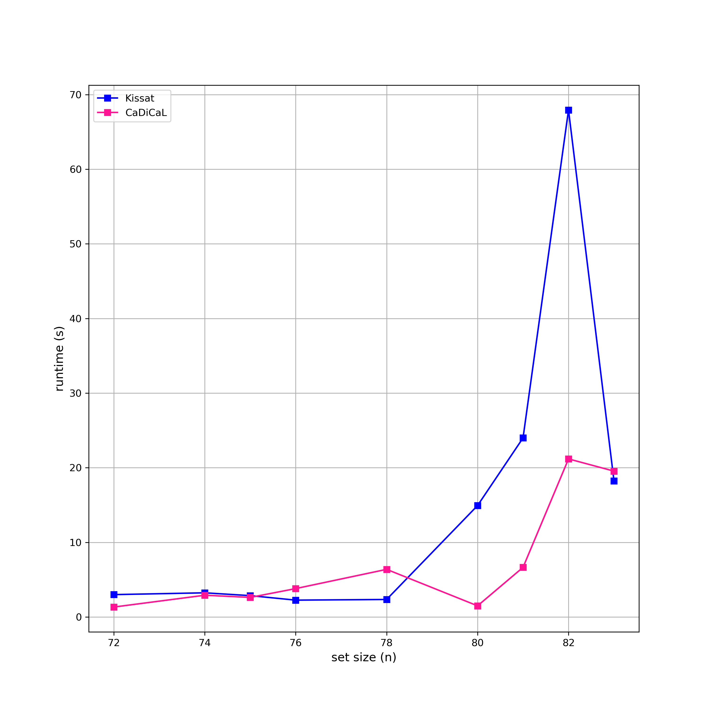

# Word Design for DNA Computing on Surfaces
This is an experimental project attempting to solve [problem 033](https://www.csplib.org/Problems/prob033/) on [CSPLib](https://www.csplib.org/).

Given a fixed size `n`, I try to find a set of `n` strings satisfying the problem constraints. I introduce a `cnfencoder` package containing `DNAEncoder`, which  reduces the problem of finding a set of a given size to SAT (helps construct a CNF formula to feed the solver and decode the solution). In pursuit of experimentation, I use three different SAT solvers – [Glucose](https://github.com/audemard/glucose), [Kissat](https://github.com/arminbiere/kissat), and [CaDiCaL](https://github.com/arminbiere/cadical) ([paper](https://cca.informatik.uni-freiburg.de/papers/BiereFallerFazekasFleuryFroleyksPollitt-CAV24.pdf)) –  and compare their performance on fixed input sizes.

## Running the code
Usage:
```
word_design.py [-h] [-n NUMBER] [-o OUTPUT] [-s SOLVER] [-q]
```

Options:
```
  -h, --help            show this help message and exit
  -n NUMBER, --number NUMBER
                        desired set size                       (default: 25)
  -o OUTPUT, --output OUTPUT
                        output DIMACS file for the CNF formula (default: formula.cnf)
  -s SOLVER, --solver SOLVER
                        the SAT solver binary name             (default: bin/glucose-syrup)
  -q, --quiet           suppress solver output
```

## Examples
1. ```
   % ./word_design.py -o examples/example1.cnf -q
   ```
   Output:
   ```
   [bin/glucose-syrup] Runtime: 0.0342 seconds
   CCTCAAAG | CGGTTTCT | GTCTTTGC | CACAAGCA | CAGCCATT | GCGGATAA | CTCCATCT | CGAGTATC | CCCAAAGT | CAGCTTAG | GACATCGT | GGCAACAA | GTAGACTC | GGTGTTTG | GAGGGAAT | GCACGATT | GCGACTTT | GTCTGCTT | GTTTCGGA | GCCATTCA | GTACGCAA | CTATAGCG | GTAAGGGT | GATCTAGG | TTGGATCG
   ```
---
2. ```
   % ./word_design.py -n 54 -o examples/example2.cnf -s bin/kissat -q
   ```
   Output:
   ```
   [bin/kissat       ] Runtime: 0.7060 seconds
   CCTAAGAC | CACGATTC | GCTGTTAC | CAAGCAAC | CTAGTTCC | CTTACGGA | CGTCACAA | AAGTCGGT | AGTGATCC | TTCGCTAC | TGGCTCTT | TTCTCGCA | TCAACCCA | AAGGAGAC | TAAGGCAG | AGCACCAT | AGCATACC | TCCTGCAT | TAGATCGG | TATCTGCC | TCCTAACC | ACCTTTCG | TCGTTGTG | AACCCGAA | ATGTCTCC | TCGATTCC | TGATACGG | ATCAGCTG | ACCAAGCA | TACTGTGC | AACCGATC | ATACCCGT | TACGTCCT | ATCTACGC | TAGCGTTG | TCTGGTCA | TCATGGGA | TACACCTC | TAGCCACT | ACGTCAAG | TGACTTCG | TGTTCGAC | AATGCACG | AAACACCC | TCCACAGT | ACACTCAG | TCACGTAC | AGCCAAAG | TTTCCCAG | ACTTCCCT | TCGGCATA | TTCAAGGG | ATCCTCCA | TCTCACTC
   ```
---
3. ```
   % ./word_design.py -n 69 -o examples/example3.cnf -s bin/glucose-syrup -q 
   ```
   Output:
   ```
   [bin/glucose-syrup] Runtime: 7.3833 seconds
   CTAATGCC | GAACCGAA | GTAGGTAG | CAAAGCCA | GATTTGCC | CTTAGGGA | GCATGTCA | CCAACAAG | GCTGATGT | GAAGTAGC | CAGTTCGT | CCTTATCC | CTCTGCTT | CAAGCCAT | CTTTCCCA | CAGGACTA | CGACGATT | GTCCGAAA | GCCCTTTT | CACCATCA | GTCTAGGA | GACTACAG | CACATCTC | GTCTTACG | GTACCATG | CATCTCAG | CATTAGGG | CCTCGTTA | CCAGAACT | GATACCGT | GAGTGATC | CGTATCCT | CGGTCTAA | GGAACACT | CCGATGAA | ACGTGTAC | TCCAATCG | TCGCCTAT | TCTCTCGA | ACACTGAC | ACCGAGTT | TGAGGACA | TCTGCATG | AACGGATG | ATCTCCAC | AGGACGAT | TCGTACCT | TAGAACGC | ACTGCGAA | AGAGACTC | ACTATGGG | AGTCCATC | AGCCACAT | TTGCTAGC | TAACTCCC | TTGTGTGG | TACGAACC | TGGTTCAC | TCTAGGCT | TCGCAGTA | TGCACCTA | ACACCCTT | TGTTGAGC | TGCTTGCT | TTGACTCC | TAAGCGTC | TGTGAGGA | ATCAGGAG | TTACCGCT
   ```
---
4. ```
   % ./word_design.py -n 69 -o examples/example4.cnf -s bin/cadical -q
   ```
   Output:
   ```
   [bin/cadical        ] Runtime: 1.1601 seconds
   CGTTACGT | GACTAACC | GGGTGAAT | GCATGATG | GTTGTGAC | CTATGTGG | CCCAAAGA | CCTTTCAC | CCAAGACT | CCTTAGCA | GCATTGCT | GATGTAGG | GTACCGAT | CTCCTAAG | GGCTTTGT | GACGTGTA | GTTCTCGT | CATGTCCA | CCTGGTTT | GCTGCAAT | GGTGGATA | GCTATCTG | CGAGAGTT | GTCTTCCA | GCGATTCA | GATTCCCT | GTGTTGTG | GACAGTCT | CGATTACG | GATCGGAA | CTGTCACA | GCTAAGGT | CTCTCCTT | CAACCTCA | CTAGCATG | CGGCTTTT | GTTACGCA | CGCACTTA | GAACACTG | GCCTACAT | CGATGCTA | GAGCTTAC | GAAGGCAT | CTCATTCC | GTTCGTTG | GCGCAATT | CAGAAGCT | GTAGATCC | CGGTTGAA | TCTTGTCC | AGGTTTCC | ATAGACGG | TAGTGGCA | TGAGCACT | ACTCCGTA | TTGGTTGC | TCCCGTAT | ACCGATTG | TTACGCCT | AACCGACA | TCAACTCG | TGGAGTGT | TCGGTGAT | TTCCAGGT | TGGCTACA | ATCGTGCT | ACCAGCTT | TCATCCTC | TCCTCTGA
   ```
---
5. ```
   % ./word_design.py -n 83 -o examples/example5.cnf -s bin/cadical -q
   ```
   Output:
   ```
   [bin/cadical        ] Runtime: 19.0707 seconds
   GTTTTGGC | GGTTCATC | GCTGACTT | CAAGCTCT | GTAACGAC | CTGTCTTG | GGTTACAG | CTTCTTGG | GGTCAGTA | CGCCTTAA | CGTTTGTG | CTCATCTC | GCATTTGG | GGAAACTC | GCGAATCT | GTGTGGTT | CCCTATAG | CCACTATC | GCTTGAGA | GACTACCT | GTTCGTTC | CAGCATCA | GCGTTCAT | GACCTATG | GAACACGA | TGCCATTC | TGTACACG | TCTATGGG | ACAATGCC | AACGCAAG | TGTTCCGA | TAACTCCG | TAGGGATG | ATGCCGTA | TCTCGTCA | ACGTTACG | TGTGGAAC | AATGCCGT | AAAACGGG | TCGCTCTA | ATCCTAGC | TGAGTGTC | TGGATCAC | TGCTTTCG | TATCGGAG | AAGAGGCT | ACCCATGT | ATCGAGTG | ACTAGCTG | ACTGTTGC | TACACCTG | TACGATGG | ACCGTCAA | AGCGATCA | TCCTTGAC | TAACCTGC | TCCCCAAA | TGGCAAAG | TCACAGTG | AGACTGAG | TTTCCCAC | TCGGTTAG | TTCGTGCT | AAGTGCAG | AATCCTCG | AGCAGATC | TTCGCATC | AGTCGCAA | ATAGGCTC | TACCTGGA | TGGTGGAA | TCATACCC | ACTTCGAG | ATGGGTGT | ACAGAAGG | ATATCCCG | TCAGTCGT | ATCCGTAG | TTGTTCGG | TAGGAGAC | AGTTGTCC | ATTGGACG | ATTCAGCC
   ```
---
6. ```
   % ./word_design.py -n 71 -o examples/example6.cnf -q
   ```
   Output:
   ```
   [./bin/glucose-syrup] Runtime: 27.2540 seconds
   GTTAGTGC | CGAAACGA | CCTTACCA | CATACGAG | CAGTAGAC | GAATCCGA | CGCAATTG | CGTCATGT | GAAGGTGT | GACATAGG | CAAGCCTT | GGACTTCA | GGTCACAA | GGGACTAT | GTGTGCAA | CAGGATCT | GGAAAGAG | GTACGCTT | GAAAGCAC | CCTTCTTG | CTCACCAA | CACACTGT | GTGAAACG | CCACAGTA | GGGATGTA | CGGGTTAA | CGATCACA | GATCCGTT | CCCAAAAC | GAACCTAG | GACTCTTC | CATCTGGA | GTAGGACA | GCAATGCT | CATTGAGC | GATTGGCA | GATGTCAG | GATCATCC | GGCTTTAG | GAGTCACT | CTATGGGA | CCGTGATA | GCCGTTTA | CAACGACT | CCTAGTCT | CTTAGCTG | GTATCGAC | CTGATTGG | AGCGAAAG | AGTAGCCA | ATTGCGGA | AACCTTCG | TGGGCATA | TCTGGTGA | TGTGGGAT | ATCCGTGT | TGAGTGGA | ACGGACAT | AAGGTGGT | AGCCTGTT | TCATGCGT | ACTCTCCT | TAACGGTG | TTTCTGCC | TCGTCGTT | ACGACAAG | TTCCTCGA | AAGTACCG | TTCGAGCT | TCCTTAGC | ACGTTCTC
   ```
You may view the `.cnf` files for each of the examples inside `examples/`.

## Experiments
To compare the performance of the three SAT solvers, I ran a race with the help of [hyperfine](https://github.com/sharkdp/hyperfine) and plotted the results.
I fed the set sizes {15, 20, 25, 30, 35, 40, 45, 50, 55, 60, 65, 66, 67, 68, 69, 70, 71} to all three solvers and {72, 74, 75, 76, 78, 80, 81, 82, 83} only to Kissat and CaDiCaL, deeming Glucose too slow to continue. Hyperfine ran each batch 4 times.

I compared the **mean runtimes** of the solvers with and without the ordering constraint that eliminated all word permutations, and the results are interesting.

With ordering:
<p align="center">
  
  
</p>

Experiments were run on Apple M3 Pro CPU (arm64) with 18 GB of unified memory on macOS 15.4.1 (Sequoia). You may find the `.cnf` for each size in `race/cnfs/` and the hyperfine reports in `race/logs/`. 

If you wish to play with the plotting, you may edit `race/race.py` and run 
```
% PYTHONPATH=. race/race.py
```
from the root repository (don't forget to make `race.py` executable with `chmod +x`)

## Results
The four biggest sets I found so far are of size **84**. You may find the formula for this size in `formula.cnf`.

1. A sequence with ordering found by Kissat in 107.3449 seconds:
   ```
   GACCATTG | GAATCCTG | CTCCAATC | GGTTTTCG | GAAGTCCT | GTCTGTTC | CCTTTCCT | CAAATCGG | GCAACTCT | CGCTTAAG | CCAGACTT | GGAATGAG | GACTAACC | GGGTCAAT | GCGTAAGA | CAGTTAGC | CACTCTCT | CCAACAAG | CGTAGATG | GATAGTCC | GATACAGG | GTATGACG | TGAGCCAT | TATGCCTC | TACCTTGC | TTCGAGAC | TGTCCGAA | TGACATGG | TCACGACT | ACGTGTAC | ACTCCTTG | ACGGTAAG | AATCCGCT | AAAACCCC | AACGGTAG | AGGCTACT | TACTGAGG | TTATCGGG | TCGTAGAG | TGAGTACG | TTCGCTTG | AACTGCCA | ATGAGGAG | TCAATGGC | TGTGGAAC | AGCTACAC | ATGCTCTG | TGCTGGAT | AGAACGGT | ACGCACAT | TCAGAGCA | ACTCTGAC | AAGCCAAC | TTTTGGCC | TTGGTGGA | TTGACAGC | AGTTCAGC | ACAGCAGA | TAAAGGCG | TGGTGTTG | ACCATCTC | AACACGTG | TCAGGTTC | ATCTTGGC | TGTCTCGT | TATGAGGG | TGCGACTA | TTCTTCCG | ACATTGCG | ACAGGGAT | TCCCTATG | TTGCAACG | TACCGCTT | TGGATCAC | TCGCTTCA | AGTGTGCA | ACAAGTGG | ACACATCC | TCTTCACG | ACGTCGTT | AGACCCTA | AGACGAAG | TCCAATCG | TTACGCAC
   ```

3. A sequence without ordering found by Kissat in 158.0229 seconds:
   ```
   TGCCATCA | GAAATCCC | CATGTCCT | TCACGTTC | GGTCTGAA | AGTGCCTT | ATGTGTCC | AAGCGAAC | ACCATTCC | AACTGCTC | TCGTTACC | TGTCTAGC | GCATTCGA | CCTCCAAT | CAAACGAG | AGCCGTTT | ATCTCACG | ACTGCTCA | TTCGCTCT | ACGGATAG | TAGCCGAA | CTATAGCG | CACCACTA | TAAGCCAC | CAGATGCA | GGCAAACT | ACCAGAAG | CTTGCCAA | ATGACCCA | TCTGAGGA | ACACGCAA | ACCCTAGT | TGGTCCTA | TGTCAGTG | TATCCTCC | CAACTACG | CCGCTTTA | CCATGATG | GACACCTT | GTCAACAG | CCTATGTC | TCGATGAG | CCAAACCT | AGACAACC | CCTTTCAG | CCCAAGAA | GTACCATC | ACCGAGTT | AGCACTGA | CCTTATCC | ATCCACCT | ACTCAGAC | GCCTTGAT | GCCTGTTA | CGGTAATC | AATCCCGA | CGCTTGTA | AAGTCCAG | ATACCTGG | TTCCTCAC | GCATCACT | ACTTCGTG | CGCATAAC | TCTAGCAC | GCTACTAG | TACCCATG | GCAGAAAC | TCTCTCCA | CATAGAGC | GTGCATAC | CTCAGGTT | ACGTAGCA | TTACGGAG | CAGAGCAT | CGAACACA | AGGAACAC | GACCTTCT | CCACAAGA | TCAGACTG | TTGACGTC | ACAACAGC | GTTGAGTC | TACGTTGC | TACGGGAT
   ```

4. A sequence with ordering found by CaDiCaL in 901.8953 seconds:
   ```
   CGAACACA | CTCACTAC | GTTATGGC | CAAAGCAC | CGATTTGC | GTGACAAG | CTCATAGG | GAATGTCC | GTCTCATC | CATCATCG | CCAGAATC | CTGTTACC | CTTCAAGC | CGAGATAG | CTACAGTG | GAAGAAGG | CTCCTTCA | CCTAGACT | GCCCATAA | TCGACATC | ACCTATGG | ATAGGACC | TCGGATCA | ACTCTGCA | TAGATCGC | TGTGACTC | TTAACCCC | AACGCAGT | AGCGAAAC | ATCTCGGA | TCATCGTG | TCACTACG | ATGCCACT | TTGGGTAG | TAGGCGAA | TCCAACGA | TGGTGAAC | TGGAATGG | TTTCCGTC | TGCCCAAA | AAGGTGTC | ATCCACTC | TACATGCG | TATCCCCT | TCTCCTGA | ACTTGCGA | ACACAGAC | AGTTCCTG | ATGGATGC | AACCTACC | AAAACCGG | ACGTGTCT | AGGATTCC | TAGCACAG | TAACCAGC | TGCTGTCA | ACTACCAC | TTCTACCG | ACGAAGTG | AATCCGAG | TTTGCAGG | AATAGGCC | TCCCTTTC | ACCGTATG | ACTCGATC | AAGCGTAC | TGGCGTTT | TAAGGCTG | TGACTCAC | TCAGCTAC | ACCACTCA | ACCCTCAT | AAGTGAGG | TACTCCAC | TCTTAGCC | ATCCGAAG | AAGTACCC | TCGAGCAT | TATGGTGC | ACAAGTGC | TCCTCACT | AGAACGTC | AGCAGTTG | AGCTTGAG
   ```
   
5. A sequence without ordering found by CaDiCaL in 78.1115 seconds:
   ```
   TTTTGGGG | TTTTCCCC | TTACCGGT | CTTACGCT | TTAAGGCC | TTAGGCGA | TTACACCG | TGTACGAC | TTGATCGG | TTCACGTG | GTTAGCCA | TTGCTGCA | TTGGGACT | TTGGATGC | GGGATTGT | TTCGCCAT | ATCTTGGC | TGTAGACG | TTGCGTTG | TTCCAGAC | CTTCTCTC | TACCTCGA | TAGGCAGA | CCAAAAGG | TACAGGGT | AGTGAAGC | TAGGTCTC | CTGACTAG | TAAGTGGG | TATGAGCC | TACGGAAC | TACTCGCA | TAACCACC | TATCCTGG | GACGATAG | TACTGCTG | TAGTGTCC | TCGCACTT | TGCTACGT | GTTACTGC | TGAACCCT | CATTGAGC | AGATCTGC | GTATCTCG | TCTAACGC | TCTGGTGT | TCCTATCG | TGCATTCC | TCGTCATC | GTACTAGG | ATGTCAGG | TGAGGGAT | ATGAGCAC | TGAGCTTG | ATTGGCTG | ATACGGAG | GTAGAGTG | TCTCTGAG | TCCCTACT | CGATGACT | CACCTATG | TGGTAGAG | TCACTTGC | TCCTTCAC | GGTATCAG | AACCCCTT | ATCGAGCT | GGTTTGTC | ACTTCGTG | GCGAATTC | GATCTTCC | ATCGCATC | AACAGTCG | CGTTACTG | ACATGGGT | TATCGCCT | AGAGTCGT | AAAACCGG | AAGCACAG | AGGATGTG | ATTCGACC | AGCAACTC | AATGCACG | AAACAGGC
   ```

It appears that the current best option for sets of large sizes is CaDiCaL without ordering.
