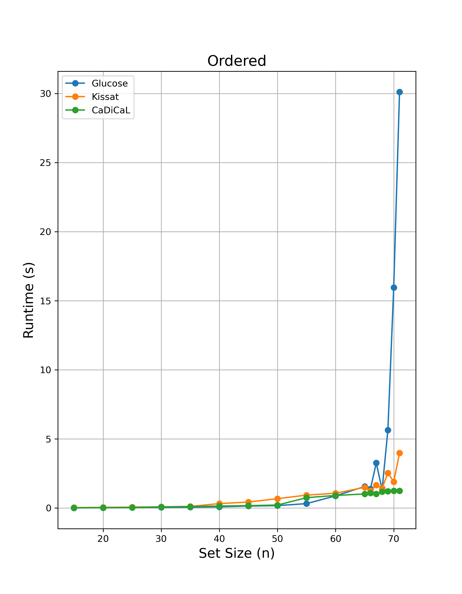
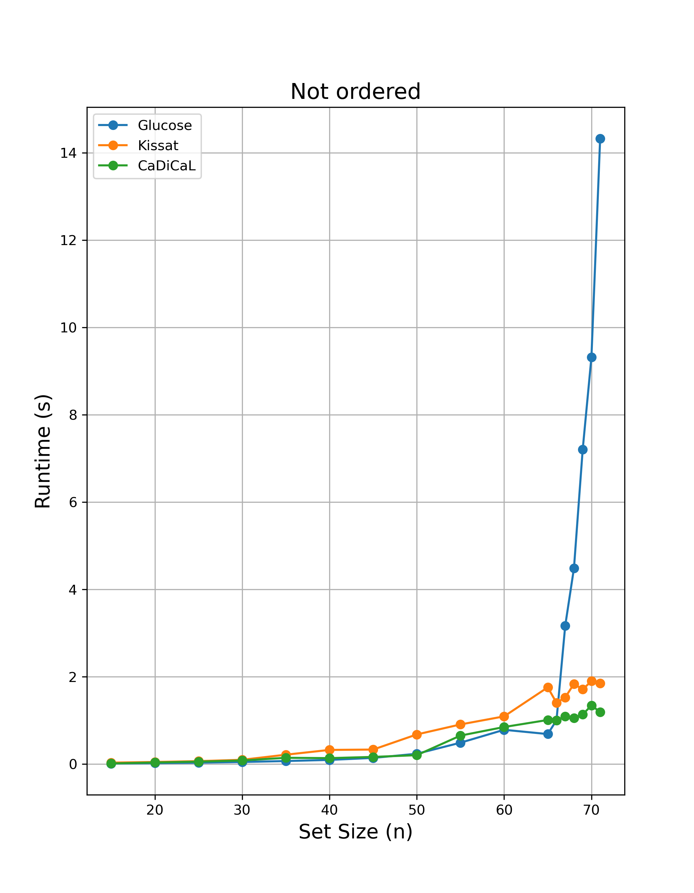
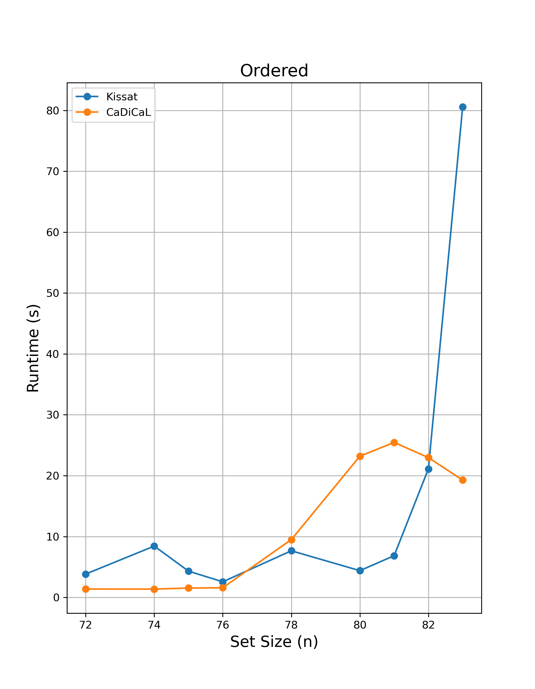
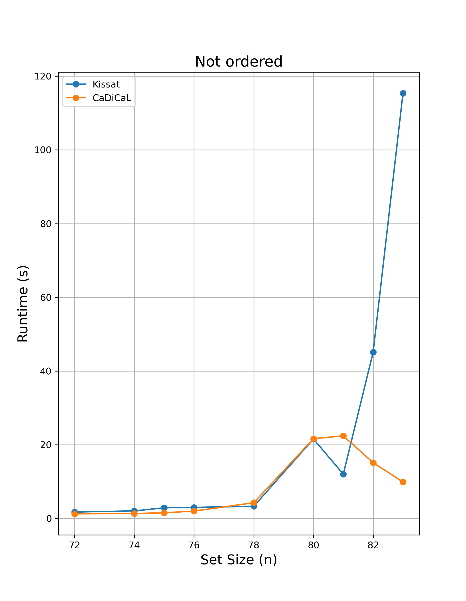
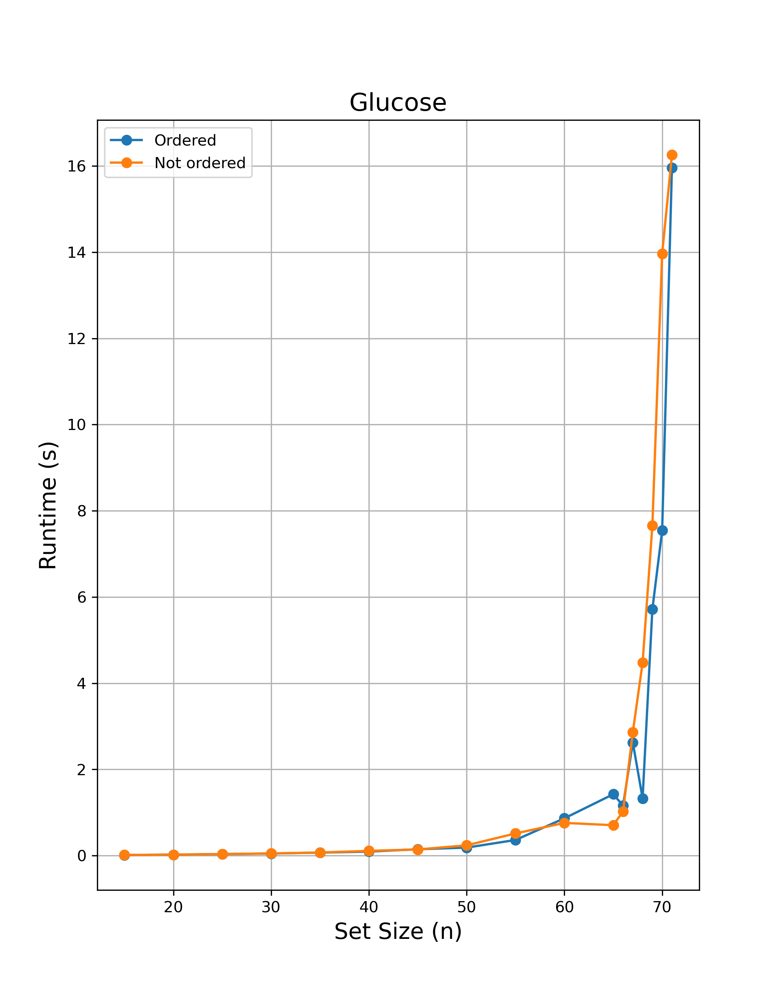
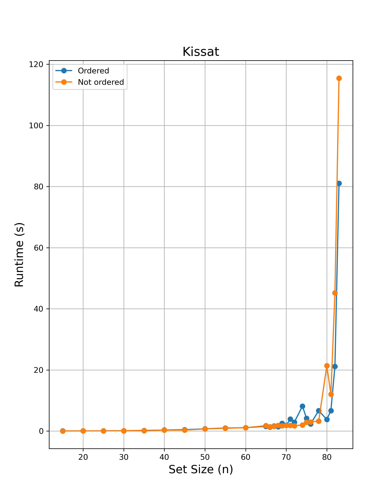
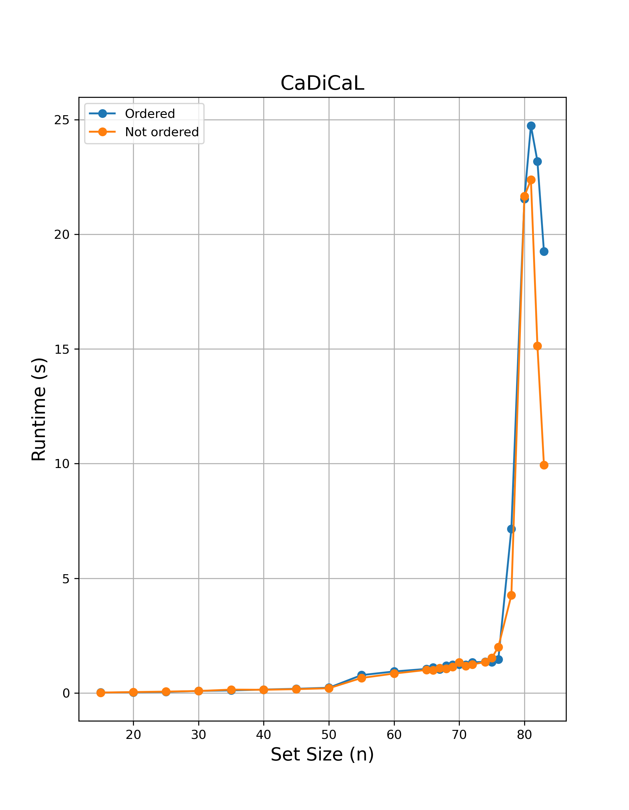

# Word Design for DNA Computing on Surfaces
This is an experimental project attempting to solve [problem 033](https://www.csplib.org/Problems/prob033/) on [CSPLib](https://www.csplib.org/).

Given a fixed size `n`, I try to find a set of `n` strings satisfying the problem constraints. I introduce a `cnfencoder` package containing `DNAEncoder`, which  reduces the problem of finding a set of a given size to SAT (helps construct a CNF formula to feed the solver and decode the solution). In pursuit of experimentation, I use three different SAT solvers – [Glucose](https://github.com/audemard/glucose), [Kissat](https://github.com/arminbiere/kissat), and [CaDiCaL](https://github.com/arminbiere/cadical) ([paper](https://cca.informatik.uni-freiburg.de/papers/BiereFallerFazekasFleuryFroleyksPollitt-CAV24.pdf)) –  and compare their performance on fixed input sizes.

## Running the code
Usage:
```
word_design.py [-h] [-n NUMBER] [-o OUTPUT] [-s SOLVER] [-q]
```

Options:
```
  -h, --help            show this help message and exit
  -n NUMBER, --number NUMBER
                        desired set size                       (default: 25)
  -of OUTPUT, --output OUTPUT
                        output DIMACS file for the CNF formula (default: formula.cnf)
  -s SOLVER, --solver SOLVER
                        the SAT solver binary name             (default: bin/glucose-syrup)
  -q, --quiet           suppress solver output
```

## Examples
1. ```
   % ./word_design.py -of examples/example1.cnf -q
   ```
   Output:
   ```
   [bin/glucose-syrup] Runtime: 0.0367 seconds
   CATCAACC | CGATGAGA | CCCGTAAA | AGAGACGT | TTCCCTTC | ACCCAAAC | CTTGGCAT | TGCCTCTT | CAGGACTT | CGTAGCTA | GGCGTTTA | AATCGAGG | TCCAAGCT | GCCTTAGT | CGACTGAA | GATTACGC | CACACGTA | CCCAATTG | GGACATTC | CTAACAGC | CTTCGTCA | TGTCACGA | ATGACGTC | CCATCCAA | CTACCCTT
   ```
---
2. ```
   % ./word_design.py -n 54 -of examples/example2.cnf -s bin/kissat -q -ord
   ```
   Output:
   ```
   [bin/kissat       ] Runtime: 0.8142 seconds
   GAACCATC | CTTCGATC | GGAAATGC | GGTTTAGC | CTAGACTC | CAATCCTG | CCAGGTAA | CTTATGGC | CACGTATC | GTCGCAAT | CCGACTTA | CCTTAGTC | CACCAACA | GCCTGTTA | CACACCAT | GACTTCCT | GTGAGCTA | CATCTTCC | CCACTACT | GTCAAGCT | CTCATCCA | GTGTCACA | GTTACCGT | CCCTCAAA | CGAACAAC | GCGTACAT | GCAACAGA | CCTAACAG | GTTCACCA | GCACCTAT | CCATACCA | CTCTCTCT | GTCCTTGT | CTACCCAA | GACACTCA | CCTCATGA | GCTCTCTT | CCTGCATT | CTCCATAC | ATCTGGCA | AGACCACA | TCTACCCA | ACCACACT | ACCGATCA | ACACACGT | AATCCCCT | AACAACCC | ACTCTGCA | ATCCCGTT | ATAACGCG | AAACGTCG | TTAGCCCT | TTCTACCG | ATACTCCC
   ```
---
3. ```
   % ./word_design.py -n 69 -of examples/example3.cnf -s bin/glucose-syrup -q 
   ```
   Output:
   ```
   [bin/glucose-syrup] Runtime: 6.5772 seconds
   GTAGAGCA | GACTTGAG | CCAGTCAT | ATGTGGGT | AGCGCATT | TTGGGTTG | GCGTCAAT | TACCCAGT | CCATGCTA | CGAGAAAG | TCTGTCTG | CGTCGTAT | GGTATGTG | CTTCAGAG | CTAGCTTC | TACTTCGC | ATCATGCG | TAGTCGTC | CATCACTC | GGAGTACT | GCCATTCT | CCGTAATC | TTTGCAGG | GTTGGTGA | AAGGTGGA | TTCCGTCT | CCTGATCT | ACGGATAG | CAAACGTG | TGGACACT | GTCTAAGC | CCTTCGTT | TATGGTCC | TCTCCTGA | TTGTCCAG | GACAAGGT | TTGAGCCA | GCCTCTTA | GTCACATG | ACTTGTGC | TACACTCG | CCACTACA | TGCTACTG | TGTCAAGC | CCGAGTTT | CTGTTGTG | TGTGTGGT | GCTCATTG | AGGTCCTA | CCAAATGC | GAATCGGA | CAGGGAAT | TACGGGTT | TAATGGCG | CTGCTTGA | GAGATTGC | TCGATAGG | CTTACCAC | GTTCCACT | GGCAGAAA | GAGCCTTT | AACAGGAC | TGAAACCC | GTGCATAC | ATGCTCCT | TCCTGGAA | AGGCTTTC | ACTAACCG | ACAGAACC
   ```
---
4. ```
   % ./word_design.py -n 69 -of examples/example4.cnf -s bin/cadical -q -ord
   ```
   Output:
   ```
   [bin/cadical      ] Runtime: 1.3771 seconds
   CGGCTAAA | CGGACATT | GCCCTTTT | GATTGGCA | GGTTTGTG | CGGGATTA | GGTCTACT | GCGAACTA | GCTTCCAT | GTTCGTTC | GACTCGTT | CCTGCTTT | GCATTGCT | GTTCAGGA | CAGATGGA | GTGTGCTT | CTTTTGCC | GTGGTGTA | GGGTTTCA | GTCAAGCT | CGTGTCAT | CGACGTTT | GGTATCGA | CCATTCTC | CAAGACAG | CTGAAGTC | CACGTTGT | GAGAGACT | CCGTGTAA | GTCGGAAA | CTACCGTA | GCAAAGAC | CAGTGATC | CTTCACCT | GCTGTATC | CCGAATCT | CTCTGGAT | CCCACAAA | CTTGGATG | GGGTAGAT | GGATGCAA | CTCATTCG | CTCGATAC | GATGATCC | GTAAGAGG | GCACATCA | GAGTCTAC | GTGTCAGA | TCTACGCA | ACTCTAGG | TCCTATGG | ATAGCTCC | ACTTGGTC | TCGCAAAG | AGAGAGGT | TACCTACG | TGACTGCA | TGGACTAG | TCGAGCAT | AGTGCGAA | ACGGTTAG | AACTGCGT | TAGAGGTG | TGTTCAGG | TGGCTTGT | TCAGGGAA | AATCCGCT | ATCCCCTT | TCGGCATA
   ```
---
5. ```
   % ./word_design.py -n 83 -of examples/example5.cnf -s bin/cadical -q
   ```
   Output:
   ```
   [bin/cadical      ] Runtime: 11.3519 seconds
   CGATTTGC | TCAACGGA | CCATGGAT | ATCTTCGC | ATTAGGGC | ACTCTCAC | TACGTACG | CTCAGTGA | TCGCGATT | CGTTGAGA | GCTATCCA | AGAAAGGG | GTGGACTA | TATCCCTG | GGAGACAT | GAGCGTAA | GGGTATAG | AGCTTGCA | TGTGAGGA | CAGAACGT | GTGGCTAT | GATACGGT | GATGCAAG | GTCAAGTC | GCTCTTTG | AGCACTGT | GCCTACTT | CGACAAAG | GAAGCGTA | TGACACCA | AGTCAAGC | CGCCATTA | CCAAGCTA | ACCTAGAG | AGACCGAT | ATGCACCT | GTTTTGGG | GGGACAAA | GAATCACC | GACTGTGT | TCCAGTTG | CAAGATGG | ACGAGTAC | AGTGTTGG | TTCTGCAG | CACGTGTT | CCTCCAAA | GGTCCATT | CTGGTAAG | TGTCGTGT | TTTCCGAC | TAAGGCGT | GACACTCA | CGGTAACT | CGAGGTAA | GCGTTAGA | TCAGGAAC | CTCTCCTA | CCTGATCA | AAACCTGC | CCTGTAGT | ACGGATGT | AACAACCC | GGTCTGAA | CCTTTGTC | CTCCTACA | CACGACAA | GAGCTATC | GTAGAAGC | ATGGCAGA | ACTGGGTA | ATGATGCG | AGCTCAAC | CATAAGCG | GGAGTACA | TTGGTGGT | AGGGAATG | GTAAGGCA | CATCTTCC | AACCGAAG | AAGGTCCA | CTGATCTC | TCAGACTG
   ```
---
6. ```
   % ./word_design.py -n 71 -of examples/example6.cnf -q
   ```
   Output:
   ```
   [bin/glucose-syrup] Runtime: 10.3126 seconds
   TTTCCGCT | TGAAAGGG | CTGGAAAG | GCCGTAAT | ATACGCGT | TTCGTCGT | TTAGCAGG | TACTACCG | TGCCTGAA | GCTTGCAA | TCGTGCTT | CTATGACC | TGGGTGTT | TAAAGCGC | GGGAGAAT | GAATGGTG | TGACTCCT | CTTCTAGG | GATGGAAC | GACTCGAT | TGGTCATC | AACTGCTC | GCAGATCT | TAAGCGTC | TTCACCTG | GGTACCTT | TCGGAACA | CGCAACAT | GCAGGATA | GGCATTGA | AGCACAGT | AGTGCGTA | CACATGCT | CTACCTAC | AGTTGGGT | TGCTTAGG | GATAGTCG | CGAAATCC | CAGCCAAT | TACCGTAG | GAGAGCTA | CTGAGTTG | ACGTGAGA | GTGTCACA | CCAACCTA | GCATAGGA | AGATGCAG | TGCCGATT | ACCACTTC | AGTAACCG | TCCTCGTA | ATGAGCAC | ACAAGTGG | CATTGCCT | ATCCCTGA | CAGTCTGA | GTCTGAGT | CCTTGTTC | GGTAAAGC | AGAGTGAC | TCGTAGAG | ACCGTCTA | CATACACC | CTTGGTGT | GTCAAGAG | CGAGCTTT | GGATACTC | CCGATTAC | GCTTCTGT | TGTAGGTC | CATGAGTG
   ```
You may view the `.cnf` files for each of the examples inside `examples/`.

## Experiments
*Experiments were run on Apple M3 Pro CPU (arm64) with 18 GB of unified memory on macOS 15.4.1 (Sequoia).*

To compare the performance of the three SAT solvers, I fed the set sizes {15, 20, 25, 30, 35, 40, 45, 50, 55, 60, 65, 66, 67, 68, 69, 70, 71} to all three solvers and {72, 74, 75, 76, 78, 80, 81, 82, 83} only to Kissat and CaDiCaL, deeming Glucose too slow to continue. I measured the results with [hyperfine](https://github.com/sharkdp/hyperfine), which ran each batch three times.

I compared the **mean runtimes** of the solvers with and without the ordering constraint that eliminated all word permutations.

<p align="center">
  
  
</p>

<p align="center">
  
  
</p>

<p align="center">
  
  
  
</p>

You may find the `.cnf` for each size in `experiments/cnfs/` and the hyperfine reports in `experiments/logs/`. 

If you wish to play with the plotting, you may edit `experiments.py` and run 
```
% ./experiments.py
```
from the root directory (don't forget to make `experiments.py` executable with `chmod +x`)

## Results
The four biggest sets I found so far are of size **84**. 

You may find the corresponding formulas in `order84.cnf` and `norder84.cnf` respectively.

1. A sequence with ordering found by Kissat in 107.3449 seconds:
   ```
   GACCATTG | GAATCCTG | CTCCAATC | GGTTTTCG | GAAGTCCT | GTCTGTTC | CCTTTCCT | CAAATCGG | GCAACTCT | CGCTTAAG | CCAGACTT | GGAATGAG | GACTAACC | GGGTCAAT | GCGTAAGA | CAGTTAGC | CACTCTCT | CCAACAAG | CGTAGATG | GATAGTCC | GATACAGG | GTATGACG | TGAGCCAT | TATGCCTC | TACCTTGC | TTCGAGAC | TGTCCGAA | TGACATGG | TCACGACT | ACGTGTAC | ACTCCTTG | ACGGTAAG | AATCCGCT | AAAACCCC | AACGGTAG | AGGCTACT | TACTGAGG | TTATCGGG | TCGTAGAG | TGAGTACG | TTCGCTTG | AACTGCCA | ATGAGGAG | TCAATGGC | TGTGGAAC | AGCTACAC | ATGCTCTG | TGCTGGAT | AGAACGGT | ACGCACAT | TCAGAGCA | ACTCTGAC | AAGCCAAC | TTTTGGCC | TTGGTGGA | TTGACAGC | AGTTCAGC | ACAGCAGA | TAAAGGCG | TGGTGTTG | ACCATCTC | AACACGTG | TCAGGTTC | ATCTTGGC | TGTCTCGT | TATGAGGG | TGCGACTA | TTCTTCCG | ACATTGCG | ACAGGGAT | TCCCTATG | TTGCAACG | TACCGCTT | TGGATCAC | TCGCTTCA | AGTGTGCA | ACAAGTGG | ACACATCC | TCTTCACG | ACGTCGTT | AGACCCTA | AGACGAAG | TCCAATCG | TTACGCAC
   ```

3. A sequence without ordering found by Kissat in 158.0229 seconds:
   ```
   TGCCATCA | GAAATCCC | CATGTCCT | TCACGTTC | GGTCTGAA | AGTGCCTT | ATGTGTCC | AAGCGAAC | ACCATTCC | AACTGCTC | TCGTTACC | TGTCTAGC | GCATTCGA | CCTCCAAT | CAAACGAG | AGCCGTTT | ATCTCACG | ACTGCTCA | TTCGCTCT | ACGGATAG | TAGCCGAA | CTATAGCG | CACCACTA | TAAGCCAC | CAGATGCA | GGCAAACT | ACCAGAAG | CTTGCCAA | ATGACCCA | TCTGAGGA | ACACGCAA | ACCCTAGT | TGGTCCTA | TGTCAGTG | TATCCTCC | CAACTACG | CCGCTTTA | CCATGATG | GACACCTT | GTCAACAG | CCTATGTC | TCGATGAG | CCAAACCT | AGACAACC | CCTTTCAG | CCCAAGAA | GTACCATC | ACCGAGTT | AGCACTGA | CCTTATCC | ATCCACCT | ACTCAGAC | GCCTTGAT | GCCTGTTA | CGGTAATC | AATCCCGA | CGCTTGTA | AAGTCCAG | ATACCTGG | TTCCTCAC | GCATCACT | ACTTCGTG | CGCATAAC | TCTAGCAC | GCTACTAG | TACCCATG | GCAGAAAC | TCTCTCCA | CATAGAGC | GTGCATAC | CTCAGGTT | ACGTAGCA | TTACGGAG | CAGAGCAT | CGAACACA | AGGAACAC | GACCTTCT | CCACAAGA | TCAGACTG | TTGACGTC | ACAACAGC | GTTGAGTC | TACGTTGC | TACGGGAT
   ```

4. A sequence with ordering found by CaDiCaL in 901.8953 seconds:
   ```
   CGAACACA | CTCACTAC | GTTATGGC | CAAAGCAC | CGATTTGC | GTGACAAG | CTCATAGG | GAATGTCC | GTCTCATC | CATCATCG | CCAGAATC | CTGTTACC | CTTCAAGC | CGAGATAG | CTACAGTG | GAAGAAGG | CTCCTTCA | CCTAGACT | GCCCATAA | TCGACATC | ACCTATGG | ATAGGACC | TCGGATCA | ACTCTGCA | TAGATCGC | TGTGACTC | TTAACCCC | AACGCAGT | AGCGAAAC | ATCTCGGA | TCATCGTG | TCACTACG | ATGCCACT | TTGGGTAG | TAGGCGAA | TCCAACGA | TGGTGAAC | TGGAATGG | TTTCCGTC | TGCCCAAA | AAGGTGTC | ATCCACTC | TACATGCG | TATCCCCT | TCTCCTGA | ACTTGCGA | ACACAGAC | AGTTCCTG | ATGGATGC | AACCTACC | AAAACCGG | ACGTGTCT | AGGATTCC | TAGCACAG | TAACCAGC | TGCTGTCA | ACTACCAC | TTCTACCG | ACGAAGTG | AATCCGAG | TTTGCAGG | AATAGGCC | TCCCTTTC | ACCGTATG | ACTCGATC | AAGCGTAC | TGGCGTTT | TAAGGCTG | TGACTCAC | TCAGCTAC | ACCACTCA | ACCCTCAT | AAGTGAGG | TACTCCAC | TCTTAGCC | ATCCGAAG | AAGTACCC | TCGAGCAT | TATGGTGC | ACAAGTGC | TCCTCACT | AGAACGTC | AGCAGTTG | AGCTTGAG
   ```
   
5. A sequence without ordering found by CaDiCaL in 78.1115 seconds:
   ```
   TTTTGGGG | TTTTCCCC | TTACCGGT | CTTACGCT | TTAAGGCC | TTAGGCGA | TTACACCG | TGTACGAC | TTGATCGG | TTCACGTG | GTTAGCCA | TTGCTGCA | TTGGGACT | TTGGATGC | GGGATTGT | TTCGCCAT | ATCTTGGC | TGTAGACG | TTGCGTTG | TTCCAGAC | CTTCTCTC | TACCTCGA | TAGGCAGA | CCAAAAGG | TACAGGGT | AGTGAAGC | TAGGTCTC | CTGACTAG | TAAGTGGG | TATGAGCC | TACGGAAC | TACTCGCA | TAACCACC | TATCCTGG | GACGATAG | TACTGCTG | TAGTGTCC | TCGCACTT | TGCTACGT | GTTACTGC | TGAACCCT | CATTGAGC | AGATCTGC | GTATCTCG | TCTAACGC | TCTGGTGT | TCCTATCG | TGCATTCC | TCGTCATC | GTACTAGG | ATGTCAGG | TGAGGGAT | ATGAGCAC | TGAGCTTG | ATTGGCTG | ATACGGAG | GTAGAGTG | TCTCTGAG | TCCCTACT | CGATGACT | CACCTATG | TGGTAGAG | TCACTTGC | TCCTTCAC | GGTATCAG | AACCCCTT | ATCGAGCT | GGTTTGTC | ACTTCGTG | GCGAATTC | GATCTTCC | ATCGCATC | AACAGTCG | CGTTACTG | ACATGGGT | TATCGCCT | AGAGTCGT | AAAACCGG | AAGCACAG | AGGATGTG | ATTCGACC | AGCAACTC | AATGCACG | AAACAGGC
   ```

It appears that the current best option for sets of large sizes is CaDiCaL without ordering.
